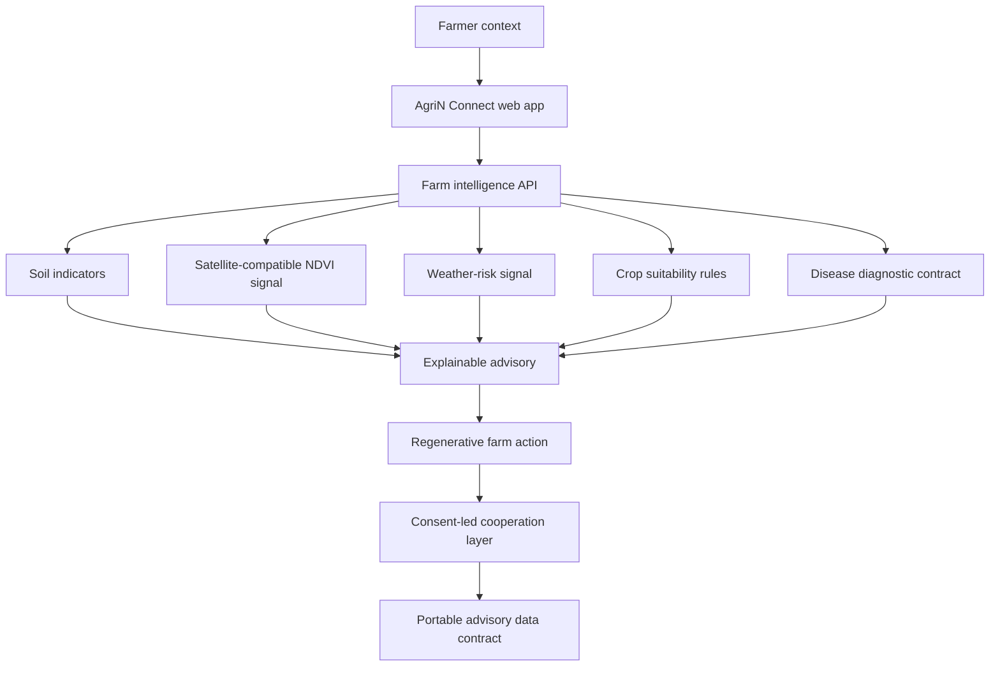
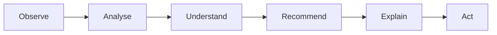

# AgriN Connect

### Interoperable AI-Powered Regenerative Agricultural Intelligence Network

> AI-powered field intelligence combining soil health, weather, satellite-derived insights and regenerative agriculture recommendations for small and marginal farmers.

[](https://github.com/ESpoorthy/farmer-app)
[](https://react.dev/)
[](https://fastapi.tiangolo.com/)
[](https://github.com/ESpoorthy/farmer-app)

## 🚀 Live Prototype

[Open AgriN Connect](https://agrin-connect.onrender.com)

## 🔗 Project Links

**Live Prototype:** https://agrin-connect.onrender.com<br>
**GitHub Repository:** https://github.com/ESpoorthy/farmer-app<br>
**Demo Video:** https://drive.google.com/file/d/1vApCx5zxKYxeaVN2gUzxoATxF7apk8Pi/view?usp=sharing

## Overview

AgriN Connect helps smallholder farmers move from fragmented, reactive farm decisions to practical field intelligence. It brings together soil-health indicators, satellite-compatible vegetation signals, weather and climate risk, crop suitability, disease-triage workflow, market context, and regenerative farming knowledge in one explainable advisory experience.

**Sense → Understand → Recommend → Act.**

The prototype is inspired by the **Track 4 — AgriN & Regenerative Agricultural Intelligence** challenge and the **BRICS theme of cooperation**. It demonstrates an interoperable intelligence layer; it is not an official BRICS or AgriN government platform.

## The Problem

Small and marginal farmers may lack access to localised agricultural intelligence. Fragmented access to soil, weather, crop, and remote-sensing information makes timely decisions harder and can increase crop, water, and climate risks.

Agricultural data, models, and best practices are also fragmented across systems. This makes interoperability and knowledge exchange difficult—even when neighbouring regions face similar climate and food-security challenges.

## Our Solution

AgriN Connect is an integrated agricultural intelligence platform, rather than a collection of disconnected tools. It uses farmer-provided context alongside standardised field signals to produce transparent, regenerative recommendations.

```text
Farmer + Field Data
        ↓
Satellite / Remote-Sensing Signal
        ↓
Soil Intelligence + Weather & Climate Risk
        ↓
Farm Intelligence
        ↓
Explainable Advisory
        ↓
Regenerative Action
```

```text
Country / Agricultural System
            ↕
   Common Advisory Data Contract
            ↕
AgriN Connect Intelligence Layer
```

## ✨ What the Prototype Demonstrates

### 🌱 AI Farm Intelligence

Ranks crop and intercrop options from season, soil type, and water availability. Each option includes a suitability score, a practical rationale, and a regenerative-fit indicator.

### 🛰️ Satellite / Field Intelligence

Generates a satellite-compatible field brief with NDVI and vegetation-trend fields. The current prototype returns deterministic sample values through a Sentinel-compatible response contract, designed to be replaced by an approved local remote-sensing provider.

### 🧪 Soil Health Intelligence

Surfaces soil texture, pH, organic carbon, and moisture indicators so farmers can see the field evidence behind a recommendation.

### ☁️ Weather & Climate Intelligence

Shows a seven-day rainfall outlook, temperature, and water-risk flag that help frame immediate farm actions. The demo uses a provider-compatible contract and deterministic data for reliable offline demonstration.

### ♻️ Regenerative Agriculture Advisor

Recommends implemented practices such as legume cover crops, residue mulching under water stress, reduced tillage, and avoiding compaction in clay soils. Crop guidance favours diversity, intercrops, and nitrogen-fixing pulses where appropriate.

### 🩺 Crop Disease Diagnostics

Provides an image-upload workflow, diagnostic response contract, confidence display, and safe escalation guidance. Its present inference response is a deterministic demo placeholder; a validated regional vision model is a production integration point.

### 🤖 Explainable AI

Every advisory is designed to be read as:

```text
Recommendation
Why
Evidence
Confidence
Suggested Action
```

The UI shows observed/simulated signal values separately from advice. This makes the demo transparent and provides a clear path for plugging in locally validated AI models.

### 📅 Farm Planning

Creates a field-task calendar with actions such as checking soil moisture, maintaining mulch cover, scouting field edges, and recording irrigation decisions.

### 📈 Market Intelligence

Displays a demo price and yield context for the top crop recommendation. Values are explicitly labelled as demo estimates and are not live market prices.

### 🤝 Cooperation Layer

Exposes an `AgriN Connect Advisory v1` model card and provenance payload. The contract groups `soil`, `satellite`, `weather`, `advisory`, and `provenance` so national partners can replace local data adapters without changing the farmer-facing experience.

## 🧭 Architecture



## 🔄 Farmer Workflow



## 🌍 Designed for Cooperation

Inspired by the AgriN / BRICS cooperation theme, the prototype demonstrates how an interoperable agricultural intelligence layer could support cross-border data and model exchange.

**Implemented today**

- A common `AgriN Connect Advisory v1` response structure and model card.
- Signal provenance and a clear distinction between demo, observed, and modelled data.
- Consent-led sharing guidance: location remains local and only aggregated, consented indicators are intended to be shareable.
- Provider-agnostic adapters for soil, satellite, weather, and disease intelligence.

**Future interoperability extensions**

- Country-aware agronomic schemas and local-language advisories.
- Regionally validated models exchanged with version and evaluation metadata.
- Federated learning or aggregate-statistic exchange without centralising raw farm records.
- National data-provider integrations governed by local data-sovereignty rules.

## 🛠️ Technology Stack

| Layer | Technology used |
| --- | --- |
| Frontend | React 19, Create React App, CSS |
| Backend | Python, FastAPI, Pydantic, Uvicorn |
| Farm intelligence | Deterministic rules and provider-compatible advisory contracts |
| Data / signals | Demo soil, satellite-compatible NDVI, and forecast-compatible weather payloads |
| Deployment | Render web service — [live prototype](https://agrin-connect.onrender.com) |

## Run Locally

Prerequisites: Python 3.10+ and Node.js 18+.

```bash
# Terminal 1 — API
cd farmer-backend
python3 -m venv .venv
source .venv/bin/activate  # Windows: .venv\\Scripts\\activate
pip install -r requirements.txt
uvicorn backend:app --reload --port 8000

# Terminal 2 — web app
cd farmer-frontend
npm ci
npm start
```

Open `http://localhost:3000`. Set conditions in **Crops**, then use **Field Intel** to generate a complete advisory.

To point a production frontend to a hosted API, build with `REACT_APP_API_URL=https://your-api.example`.

## API Surface

| Endpoint | Purpose |
| --- | --- |
| `GET /health` | Service health check |
| `POST /field-intelligence` | Soil, satellite, weather, advisory, and provenance brief |
| `POST /recommend_crop` | Explainable regenerative crop/intercrop ranking |
| `POST /upload_image` | Disease-diagnostic workflow contract |
| `POST /predict_price` | Demo market price and yield context |
| `POST /farmer_calendar` | Farm task timeline |
| `GET /cooperation/model-card` | Inputs, outputs, and governance metadata |

## Documentation

- [Architecture](docs/architecture.md)
- [AgriN advisory data contract](docs/agrin-data-contract.md)
- [Regenerative agriculture approach](docs/regenerative-agriculture.md)
- [Submission demo walkthrough](docs/DEMO.md)

## Responsible Use

AgriN Connect is a competition prototype. Its sample signals, crop rules, disease result, and market estimates are not a substitute for local agronomic expertise. Production use requires region-specific validation, farmer consent, locally appropriate model evaluation, and clear uncertainty communication.

## Repository Layout

```text
farmer-app/
├── farmer-frontend/  # React farmer experience
├── farmer-backend/   # FastAPI advisory API
└── docs/             # architecture, data contract, and demo materials
```
