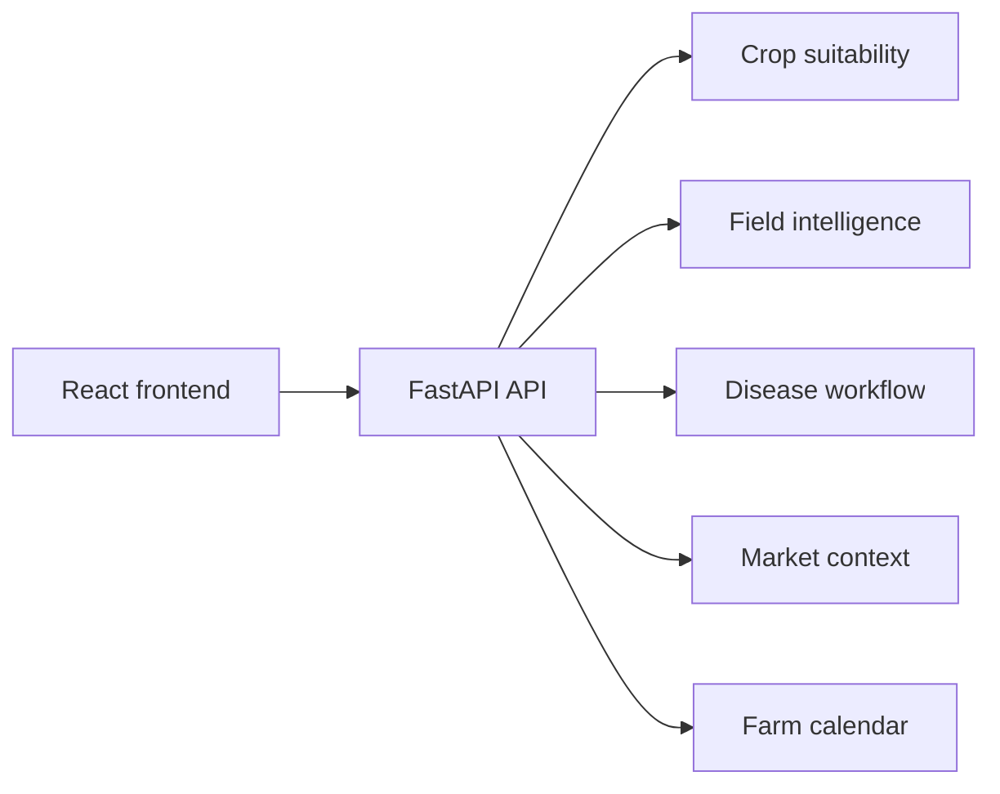

# AgriN Connect Architecture

## Runtime components

The React frontend collects farmer context and renders the advisory. The FastAPI backend supplies deterministic, explainable demo intelligence through a portable HTTP contract.



## Data modes

The prototype intentionally operates in a **demo / offline-ready** mode. It uses deterministic values for NDVI, soil-health indicators, weather outlook, diagnostic result, and market context. This is visible in API payloads and avoids representing simulated data as observed data.

## Production adapter points

| Signal | Current implementation | Production replacement |
| --- | --- | --- |
| Vegetation | Sentinel-compatible NDVI payload | Approved national Earth-observation catalogue |
| Soil | Farmer-selected texture plus demo values | Soil lab, public grid, or consented sensor feed |
| Weather | Forecast-compatible payload | National meteorological service or approved provider |
| Disease | Fixed diagnostic contract | Regionally validated image model with human escalation |

## Deployment shape

```text
Public React frontend
        ↓ REACT_APP_API_URL
Public FastAPI API
        ↓
Approved local data/model adapters
```

The frontend defaults to a local API only in development. A public build receives the API origin through `REACT_APP_API_URL`.
